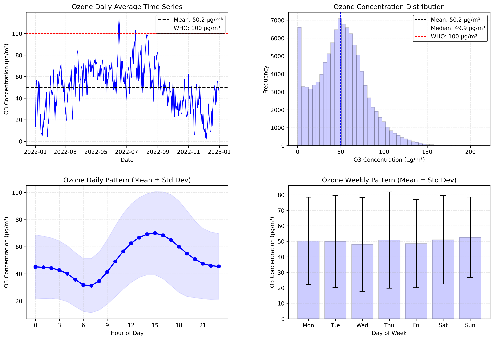

## Air Quality Time Series Analysis - Paris - Ozone (O3)

A project demonstrating air quality data analysis using Python and the [European Environment Agency (EEA)](https://www.eea.europa.eu/en) API.


*Photo credit: Masood Aslami - Paris, France*


### Project Overview

This project analyzes O3 (Ozone) air pollution across France during 2022, demonstrating:
- Data acquisition from public APIs
- Data cleaning and validation
- Time series analysis
- Statistical analysis and visualization

### Technologies Used

- **Python 3.9+**
- **pandas** - Data manipulation
- **numpy** - Numerical operations
- **matplotlib** - Visualization
- **scipy** - Statistical analysis
- **requests** - API interaction
- **pyarrow** - Parquet file handling

### Getting Started

#### Prerequisites

```bash
python -m venv env
source env/bin/activate  # On Windows: env\Scripts\activate
pip install -r requirements.txt
```

#### Run the Analysis

```bash
jupyter lab paris_air_quality_analysis.ipynb
```

The notebook will:
1. Download O3 data from EEA API (12 months, 13 stations from Paris area)
2. Clean and validate the data
3. Perform statistical analysis
4. Generate visualizations
5. Save processed data

### Project Structure

```
paris_air_quality_analysis/
├── paris_air_quality_analysis.ipynb  # Main analysis notebook
├── data/
│   ├── raw/                          # Downloaded data (auto-generated)
│   └── processed/                    # Cleaned data (auto-generated)
├── requirements.txt                  # Python dependencies
└── README.md                         # This file
```

### Visualizations



  **Figure 1:** Comprehensive O3 air quality analysis for Paris region (2022).
  - *Top left:* Daily average time series showing seasonal variation
  - *Top right:* Concentration distribution with WHO guideline reference
  - *Bottom left:* Hourly pattern revealing photochemical production peak
  - *Bottom right:* Weekly pattern showing weekend effects

  *Data: 109,000+ measurements from 13 EEA monitoring stations*


### Key Findings

- **Daily Cycle:** O3 shows strong diurnal pattern with peak in afternoon (photochemical production)
- **Weekly Pattern:** Higher concentrations on weekends (less NO titration from traffic)
- **Seasonal Variation:** Visible across the 12-month period
- **Data Quality:** Robust outlier removal and validation


### Data Source

- **Provider:** European Environment Agency (EEA)
- **API:** https://eeadmz1-downloads-api-appservice.azurewebsites.net/
- **Dataset:** Validated air quality measurements from official monitoring stations
- **Location:** 13 monitoring stations across Paris area
- **Period:** 12 months (January - December 2022)
- **Pollutant:** O3 (Ozone)
- **Format:** Parquet files (compressed columnar storage)

### Summary

- API integration and data acquisition
- Data cleaning and quality control
- Time series analysis
- Statistical analysis (percentiles, outliers, trends)
- Data visualization
- Scientific Python stack 

### License

Data is provided by the European Environment Agency.

